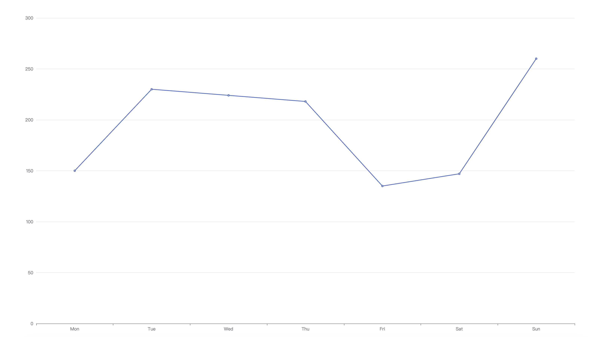
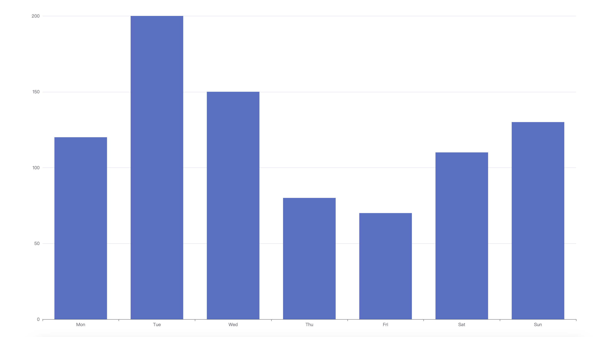
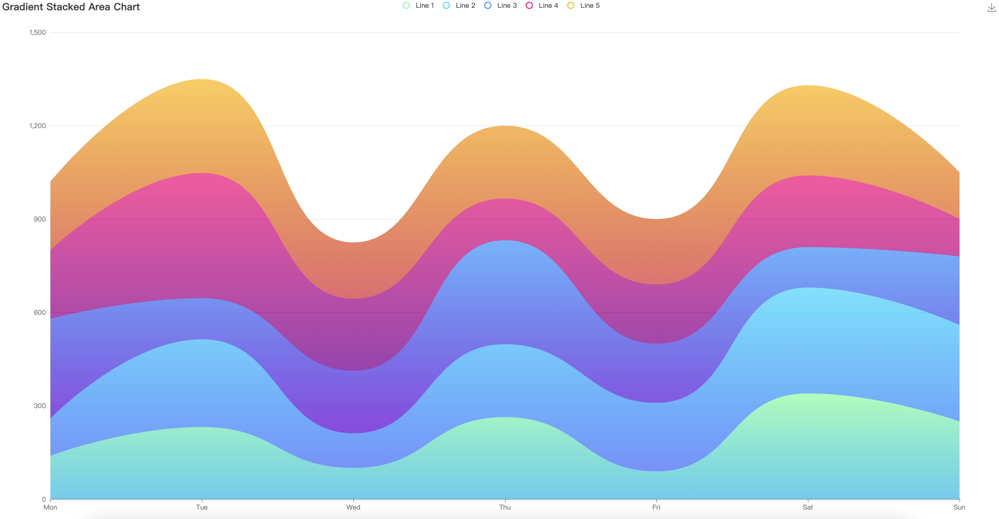

# Quick-ECharts

一个简单高效的ECharts图表快速生成工具，基于Go语言和Gin框架开发。

## 功能特点

- 快速生成ECharts图表，无需编写HTML和JavaScript代码
- 通过简单的HTTP请求即可渲染复杂的图表
- 支持所有ECharts图表类型（折线图、柱状图、饼图等）
- 轻量级服务，易于部署和使用
- 支持自定义图表配置选项

## 安装

### 从源码构建

```bash
# 克隆仓库
git clone https://github.com/open-unbounded/quick-echarts.git
cd quick-echarts

# 构建项目
go build -o quick-echarts
```

### 使用预编译二进制文件

可以使用build.sh脚本为不同平台构建二进制文件：

```bash
./build.sh
```

## 使用方法

### 启动服务

```bash
# 默认在0.0.0.0:8080端口启动
./quick-echarts

# 指定端口启动
./quick-echarts --addr=127.0.0.1:3000
```

### 生成图表

向`/chart`接口发送GET请求，通过`c`参数传递ECharts配置选项（JSON格式）：

```
http://localhost:8080/chart?c={"xAxis":{"type":"category","data":["Mon","Tue","Wed","Thu","Fri","Sat","Sun"]},"yAxis":{"type":"value"},"series":[{"data":[150,230,224,218,135,147,260],"type":"line"}]}
```

### 示例

1. 简单折线图

```text
http://localhost:8080/chart?c={"xAxis":{"type":"category","data":["Mon","Tue","Wed","Thu","Fri","Sat","Sun"]},"yAxis":{"type":"value"},"series":[{"data":[150,230,224,218,135,147,260],"type":"line"}]}
```


2. 柱状图

```text
http://localhost:8080/chart?c={"xAxis":{"type":"category","data":["Mon","Tue","Wed","Thu","Fri","Sat","Sun"]},"yAxis":{"type":"value"},"series":[{"data":[120,200,150,80,70,110,130],"type":"bar"}]}
```


3. 堆叠面积图(复杂JSON配置需使用URL编码)
```text
http://localhost:8080/chart?c=%7B%22color%22%3A%5B%22%2380FFA5%22%2C%22%2300DDFF%22%2C%22%2337A2FF%22%2C%22%23FF0087%22%2C%22%23FFBF00%22%5D%2C%22title%22%3A%7B%22text%22%3A%22Gradient%20Stacked%20Area%20Chart%22%7D%2C%22tooltip%22%3A%7B%22trigger%22%3A%22axis%22%2C%22axisPointer%22%3A%7B%22type%22%3A%22cross%22%2C%22label%22%3A%7B%22backgroundColor%22%3A%22%236a7985%22%7D%7D%7D%2C%22legend%22%3A%7B%22data%22%3A%5B%22Line%201%22%2C%22Line%202%22%2C%22Line%203%22%2C%22Line%204%22%2C%22Line%205%22%5D%7D%2C%22toolbox%22%3A%7B%22feature%22%3A%7B%22saveAsImage%22%3A%7B%7D%7D%7D%2C%22grid%22%3A%7B%22left%22%3A%223%25%22%2C%22right%22%3A%224%25%22%2C%22bottom%22%3A%223%25%22%2C%22containLabel%22%3Atrue%7D%2C%22xAxis%22%3A%5B%7B%22type%22%3A%22category%22%2C%22boundaryGap%22%3Afalse%2C%22data%22%3A%5B%22Mon%22%2C%22Tue%22%2C%22Wed%22%2C%22Thu%22%2C%22Fri%22%2C%22Sat%22%2C%22Sun%22%5D%7D%5D%2C%22yAxis%22%3A%5B%7B%22type%22%3A%22value%22%7D%5D%2C%22series%22%3A%5B%7B%22name%22%3A%22Line%201%22%2C%22type%22%3A%22line%22%2C%22stack%22%3A%22Total%22%2C%22smooth%22%3Atrue%2C%22lineStyle%22%3A%7B%22width%22%3A0%7D%2C%22showSymbol%22%3Afalse%2C%22areaStyle%22%3A%7B%22opacity%22%3A0.8%2C%22color%22%3A%7B%22colorStops%22%3A%5B%7B%22offset%22%3A0%2C%22color%22%3A%22rgb(128%2C%20255%2C%20165)%22%7D%2C%7B%22offset%22%3A1%2C%22color%22%3A%22rgb(1%2C%20191%2C%20236)%22%7D%5D%2C%22x%22%3A0%2C%22y%22%3A0%2C%22x2%22%3A0%2C%22y2%22%3A1%2C%22type%22%3A%22linear%22%2C%22global%22%3Afalse%7D%7D%2C%22emphasis%22%3A%7B%22focus%22%3A%22series%22%7D%2C%22data%22%3A%5B140%2C232%2C101%2C264%2C90%2C340%2C250%5D%7D%2C%7B%22name%22%3A%22Line%202%22%2C%22type%22%3A%22line%22%2C%22stack%22%3A%22Total%22%2C%22smooth%22%3Atrue%2C%22lineStyle%22%3A%7B%22width%22%3A0%7D%2C%22showSymbol%22%3Afalse%2C%22areaStyle%22%3A%7B%22opacity%22%3A0.8%2C%22color%22%3A%7B%22colorStops%22%3A%5B%7B%22offset%22%3A0%2C%22color%22%3A%22rgb(0%2C%20221%2C%20255)%22%7D%2C%7B%22offset%22%3A1%2C%22color%22%3A%22rgb(77%2C%20119%2C%20255)%22%7D%5D%2C%22x%22%3A0%2C%22y%22%3A0%2C%22x2%22%3A0%2C%22y2%22%3A1%2C%22type%22%3A%22linear%22%2C%22global%22%3Afalse%7D%7D%2C%22emphasis%22%3A%7B%22focus%22%3A%22series%22%7D%2C%22data%22%3A%5B120%2C282%2C111%2C234%2C220%2C340%2C310%5D%7D%2C%7B%22name%22%3A%22Line%203%22%2C%22type%22%3A%22line%22%2C%22stack%22%3A%22Total%22%2C%22smooth%22%3Atrue%2C%22lineStyle%22%3A%7B%22width%22%3A0%7D%2C%22showSymbol%22%3Afalse%2C%22areaStyle%22%3A%7B%22opacity%22%3A0.8%2C%22color%22%3A%7B%22colorStops%22%3A%5B%7B%22offset%22%3A0%2C%22color%22%3A%22rgb(55%2C%20162%2C%20255)%22%7D%2C%7B%22offset%22%3A1%2C%22color%22%3A%22rgb(116%2C%2021%2C%20219)%22%7D%5D%2C%22x%22%3A0%2C%22y%22%3A0%2C%22x2%22%3A0%2C%22y2%22%3A1%2C%22type%22%3A%22linear%22%2C%22global%22%3Afalse%7D%7D%2C%22emphasis%22%3A%7B%22focus%22%3A%22series%22%7D%2C%22data%22%3A%5B320%2C132%2C201%2C334%2C190%2C130%2C220%5D%7D%2C%7B%22name%22%3A%22Line%204%22%2C%22type%22%3A%22line%22%2C%22stack%22%3A%22Total%22%2C%22smooth%22%3Atrue%2C%22lineStyle%22%3A%7B%22width%22%3A0%7D%2C%22showSymbol%22%3Afalse%2C%22areaStyle%22%3A%7B%22opacity%22%3A0.8%2C%22color%22%3A%7B%22colorStops%22%3A%5B%7B%22offset%22%3A0%2C%22color%22%3A%22rgb(255%2C%200%2C%20135)%22%7D%2C%7B%22offset%22%3A1%2C%22color%22%3A%22rgb(135%2C%200%2C%20157)%22%7D%5D%2C%22x%22%3A0%2C%22y%22%3A0%2C%22x2%22%3A0%2C%22y2%22%3A1%2C%22type%22%3A%22linear%22%2C%22global%22%3Afalse%7D%7D%2C%22emphasis%22%3A%7B%22focus%22%3A%22series%22%7D%2C%22data%22%3A%5B220%2C402%2C231%2C134%2C190%2C230%2C120%5D%7D%2C%7B%22name%22%3A%22Line%205%22%2C%22type%22%3A%22line%22%2C%22stack%22%3A%22Total%22%2C%22smooth%22%3Atrue%2C%22lineStyle%22%3A%7B%22width%22%3A0%7D%2C%22showSymbol%22%3Afalse%2C%22label%22%3A%7B%22show%22%3Atrue%2C%22position%22%3A%22top%22%7D%2C%22areaStyle%22%3A%7B%22opacity%22%3A0.8%2C%22color%22%3A%7B%22colorStops%22%3A%5B%7B%22offset%22%3A0%2C%22color%22%3A%22rgb(255%2C%20191%2C%200)%22%7D%2C%7B%22offset%22%3A1%2C%22color%22%3A%22rgb(224%2C%2062%2C%2076)%22%7D%5D%2C%22x%22%3A0%2C%22y%22%3A0%2C%22x2%22%3A0%2C%22y2%22%3A1%2C%22type%22%3A%22linear%22%2C%22global%22%3Afalse%7D%7D%2C%22emphasis%22%3A%7B%22focus%22%3A%22series%22%7D%2C%22data%22%3A%5B220%2C302%2C181%2C234%2C210%2C290%2C150%5D%7D%5D%7D
```


## 依赖

- [Gin Web Framework](https://github.com/gin-gonic/gin) - HTTP Web框架
- [ECharts](https://echarts.apache.org/) - 图表渲染库

## 许可证

本项目采用 [Apache License 2.0](LICENSE) 许可证。